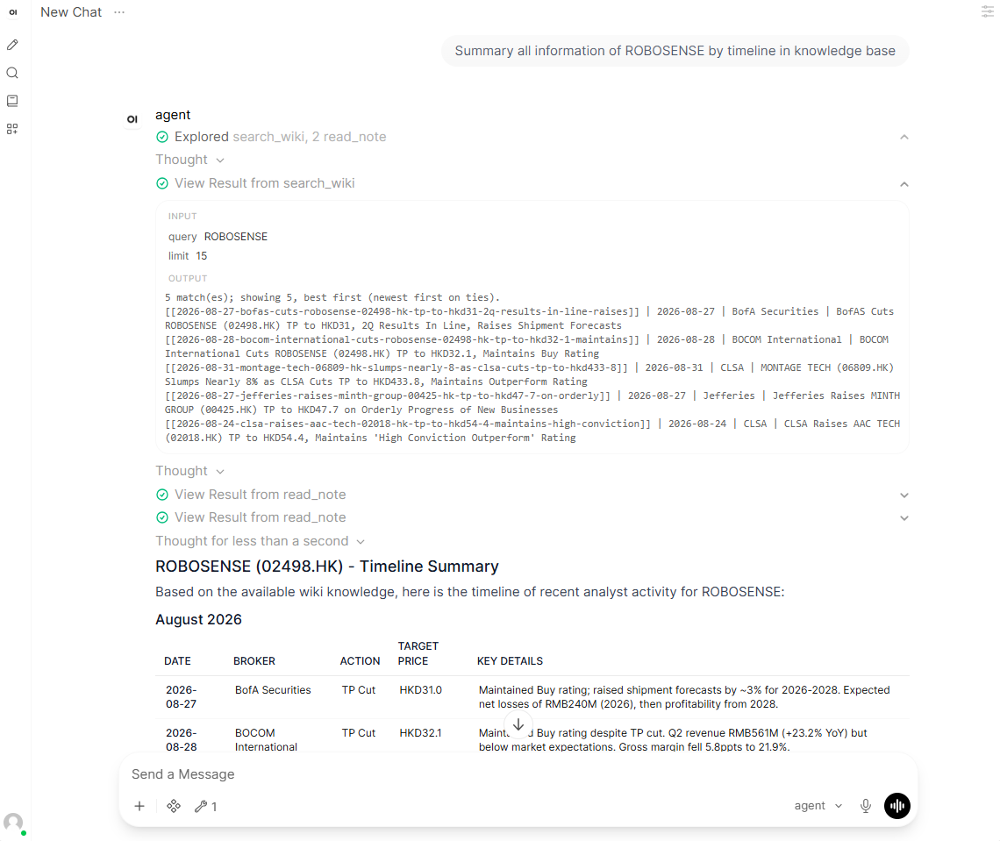
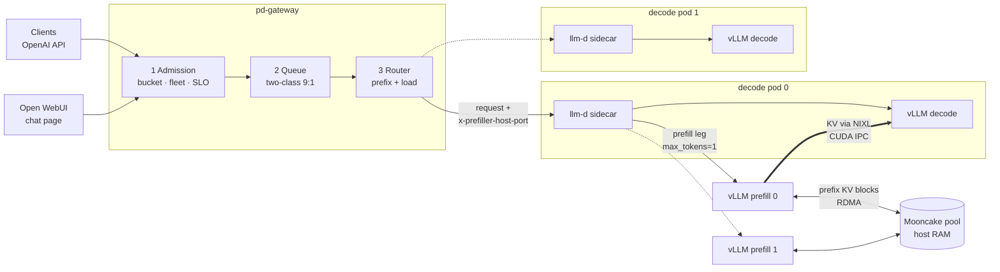

# Design Inference Cluster in Knowledge-based Agent



*The chat page (Open WebUI) on this stack: the model calls `search_wiki`, opens the notes with `read_note`, and answers with a dated, cited timeline.*

## Architecture

| Part | Decision | Why |
| :--- | :--- | :--- |
| Northbound | No fallback to an external API | No data leaves the cluster |
| Admission | Token bucket per tenant + fleet health + SLO deadline | Turns away work it cannot serve, so overload does not take the whole system down |
| Queue | Two classes (short / long prompts, 9:1) | Long prompts cannot block the short ones (head-of-line blocking) |
| Router | Prefix-aware routing with a load bound | Keeps the E2E latency of agent calls in a narrow range |
| Cache | KV offloading to Mooncake (LRU eviction) | Good TTFT in multi-turn conversations |
| Engine | vLLM | More efficient KV-cache use than SGLang for this workload |
| Pod | Prefill/decode disaggregation | Aggregated (normal) pods showed more variance in E2E latency |
| Device | HAMi | Splits one GPU into slices, so the prefill and decode pods can share it |
| Scaling | KEDA (planned; this repo runs a fixed 2 prefill + 2 decode) | Start with 2 pods (1 prefill, 1 decode) and scale on in-flight requests |

Serve an LLM on **one GPU box** with **prefill/decode disaggregation**, behind a small gateway
that decides **who gets in, who goes next, and where each request runs**.

- **vLLM P/D**: 2 prefill pods + 2 decode pods, all on one GPU split into 4 slices (HAMi).
- **KV hand-off**: the prefill pod writes the prompt's KV cache straight into the decode pod's GPU memory (NIXL over CUDA IPC).
- **Shared prefix cache**: both prefill pods share a pool of host RAM for KV blocks (Mooncake over RDMA), so a prompt computed on one prefill pod is a cache hit on the other.
- **Gateway** (about 1,000 lines of Python), in three stages:
  1. **Admission** turns away work it cannot serve in time: a token bucket per tenant, a fleet-saturation check, and an SLO deadline estimate.
  2. **Queue**: a two-class queue (short / long prompts, served 9:1) holds requests until a decode slot is free.
  3. **Router**: prefix-aware routing with a load bound, so follow-up turns land where their KV is cached.
- **Chat page**: [Open WebUI](https://github.com/open-webui/open-webui) in front of the gateway, to try it by hand.
  Optionally, the model can search a folder of your Markdown notes (**wiki tools**).
- **Monitoring**: Prometheus + Grafana with 9 ready-made dashboards, plus the NVIDIA DCGM exporter.

Everything runs on single-node Kubernetes (k3s). The default model is `Qwen/Qwen3.5-4B` with thinking on.



## How one request flows

1. The client sends a normal OpenAI chat request to the gateway (port 8080). It can add an `x-tenant` header.
2. **Admission** checks three things, in order. If any check fails, the client gets `429` or `503` right away, with a `Retry-After` header:
   - the tenant's token bucket has room;
   - at least one prefill pod and one decode pod are not saturated (KV cache < 80% full);
   - the request can finish within the SLO (26 s by default).
3. The **queue** holds the request until a decode pod has a free slot (9 per pod = vLLM's `--max-num-seqs`). While short prompts (≤ 10k tokens) and long prompts both wait, 9 short go for every 1 long.
4. The **router** picks a decode pod (among those with a free slot) and a prefill pod. It prefers the pod that has already seen the longest prefix of this prompt, but never one that is much busier than average.
5. The decode pod's **llm-d sidecar** sends the prompt to the chosen prefill pod (`max_tokens=1`). The prefill pod computes the KV and loads any cached prefix blocks from Mooncake. It then **pushes** the KV into the decode pod's GPU memory.
6. The **decode vLLM** generates the answer, and it streams back through the sidecar and the gateway to the client.

## Requirements

| | |
|---|---|
| GPU | 1 × NVIDIA H100 80 GB (tested on H100 PCIe). Any GPU with ≥ 64 GB and CUDA IPC should work: there are 4 slices of 16 GiB. |
| OS | Ubuntu 22.04 with the NVIDIA driver and the NVIDIA container toolkit (Lambda Stack images have both) |
| Host RAM | ≥ 128 GB: each prefill pod lends 40 GB to Mooncake (`MOONCAKE_SEGMENT`) |
| Network | For RDMA, a RoCE / InfiniBand NIC (for example Mellanox `mlx5_0`). Without one, set `MOONCAKE_RDMA=0` to use TCP. |
| Disk | ~40 GB (images + model) |
| Access | `sudo`, and internet access to download k3s, Helm charts, container images and the model |

## Quick start

On the GPU box:

```bash
git clone <this repo> pd-vllm-gateway && cd pd-vllm-gateway
cp .env.example .env          # optional: HF token and overrides
bash scripts/cluster-up.sh    # once: k3s, HAMi, Prometheus, Grafana, DCGM (~10 min)
bash scripts/deploy.sh        # the stack: model download, Mooncake, 4 vLLM pods, gateway, Open WebUI (~5 min)
bash scripts/smoke.sh         # end-to-end check; ends with SMOKE PASS
```

**Try it in the browser.** From your laptop, open an SSH tunnel and go to http://127.0.0.1:30030. There is no login by default.

```bash
ssh -L 30030:127.0.0.1:30030 ubuntu@<gpu-box>
```

Open WebUI shows the model's thinking in a collapsible block, then the answer.
To let the model answer from your own notes, see [Wiki tools](#wiki-tools-chat-with-your-notes).

**Or talk to it like any OpenAI endpoint:**

```bash
curl -s http://127.0.0.1:8080/v1/chat/completions \
  -H 'Content-Type: application/json' -H 'x-tenant: team-a' \
  -d '{"model": "agent", "messages": [{"role": "user", "content": "Explain KV caching in two sentences."}], "max_tokens": 1024}'
```

```python
from openai import OpenAI
client = OpenAI(base_url="http://127.0.0.1:8080/v1", api_key="unused", default_headers={"x-tenant": "team-a"})
r = client.chat.completions.create(model="agent", messages=[{"role": "user", "content": "Hi!"}], max_tokens=512)
print(r.choices[0].message.content)
```

The gateway listens on port 8080 of the node and Open WebUI on port 30030. **Neither asks for a password by default.**
Keep both ports closed to the internet and reach them through an SSH tunnel or a private network (see [Security](#security)).

Other scripts:

```bash
bash scripts/status.sh                        # pods, GPU, the gateway's view, request counters
bash scripts/admission.sh                     # admission config, counters and live estimate inputs
python3 loadtest/loadtest.py --users 30       # load test (below)
bash scripts/webui.sh [down]                  # start / remove Open WebUI on its own
bash scripts/teardown.sh                      # remove the stack (monitoring, Open WebUI and the model stay)
```

## Configuration

All settings live in [`config.sh`](config.sh). To override one, put it in `.env` or set it on the command line, then redeploy:

```bash
SLO_S=40 QUEUE_POLICY=fcfs bash scripts/deploy.sh
```

| Setting | Default | What it does |
|---|---|---|
| `MODEL` | `Qwen/Qwen3.5-4B` | Hugging Face model id |
| `SERVED_MODEL_NAME` | `agent` | the `model` name clients send |
| `THINKING` | `1` | the model thinks by default (clients can turn it off per request) |
| `MAX_NUM_SEQS` | `9` | running requests per vLLM pod, and gateway slots per decode pod |
| `GPU_MEM_MIB` / `GPU_CORES` | `16384` / `25` | memory and % of SMs per GPU slice |
| `GPU_INDEX` | `0` | the GPU all four slices share |
| `MOONCAKE_RDMA` | `1` | `1` = RDMA (needs a RoCE / IB NIC), `0` = TCP |
| `MOONCAKE_DEVICE` / `MOONCAKE_GID_INDEX` | `mlx5_0` / `3` | the RDMA device and its RoCE v2 GID index (see [Troubleshooting](#troubleshooting)) |
| `MOONCAKE_SEGMENT` | `40GB` | host RAM each prefill pod lends to the shared KV pool |
| `ADMISSION` | `all` | `all`, `off`, or a list such as `bucket,slo` |
| `SLO_S` | `26` | deadline in seconds for the `slo` check (a request can send its own in `x-slo-s`) |
| `SLO_DRAIN` | `littles` | how the `slo` check estimates the queue's drain rate: `littles` or `completions` (see below) |
| `BUCKET_TOKENS_PER_S` / `BUCKET_BURST` | `3000` / `60000` | token bucket per tenant |
| `KV_SATURATION` | `0.80` | KV usage at which a pod counts as full for the `fleet` check |
| `QUEUE_POLICY` | `two-class` | `two-class`, `fcfs`, `tenant-rr` or `none` |
| `LONG_PROMPT_TOKENS` / `QUEUE_CLASS_WEIGHTS` | `10000` / `9:1` | where "long" starts, and the short:long service ratio |
| `ROUTER_POLICY` | `prefix-load` | `prefix-load`, `least-loaded`, `round-robin` or `random` |
| `CACHE_SALT` | `off` | `tenant` = each tenant gets its own prefix cache (no sharing between tenants) |
| `GATEWAY_TRACE` | `1` | one JSON line per request in `traces/gateway.jsonl` |
| `WEBUI` / `WEBUI_PORT` | `1` / `30030` | start Open WebUI with the stack, and its node port |
| `WIKI_DIR` / `WIKI_DESCRIPTION` | empty / `notes` | a host folder of Markdown notes the chat model can search, and what the notes are ([Wiki tools](#wiki-tools-chat-with-your-notes)) |
| `WEBUI_AUTH` | `false` | `true` = accounts; the first person to sign up becomes the admin. Set it before the first start: switching later needs an empty `WEBUI_DATA_DIR` (`/var/lib/open-webui`). |

## The gateway

### 1. Admission

Three levels, checked in this order. The first one that says no answers the client, and the request
never reaches the queue or a GPU.

| Level | Refuses when | Answer |
|---|---|---|
| `bucket` | the tenant's token bucket is empty. Each request takes its estimated prompt tokens + min(`max_tokens`, 1024). When it ends, the bucket is settled to the tokens really used. | `429` `tenant_tokens`, `Retry-After` = time to refill |
| `fleet` | every prefill pod (or every decode pod) is unreachable or has KV usage ≥ `KV_SATURATION`. Pods are scraped every second. | `503` `kv_free` / `no_eligible_pod`, `Retry-After: 2` |
| `slo` | the estimated finish time is later than the deadline (`SLO_S`, or the request's `x-slo-s` header) | `429` `deadline_unmeetable`, `Retry-After: 2`, the estimate in the body |

The `slo` estimate:

```
est_ttft  = queue_wait + n_in / prefill_tokens_per_s
est_total = est_ttft  + n_out * inter_token_latency
```

| Input | Where it comes from |
|---|---|
| `queue_wait` | (requests waiting in the gateway queue + requests waiting in vLLM on the decode pods) ÷ drain rate |
| drain rate | `SLO_DRAIN=littles` (default), from Little's law: requests in service on the decode pods ÷ their mean service time. `completions`: calls finished per second over the last 30 s, the version we measured first (see [Known limitations](#known-limitations)). |
| `n_in` | the gateway's prompt-token estimate (from the message size; the gateway has no tokenizer) |
| `prefill_tokens_per_s` | vLLM prefill counters on the prefill pods, over the last 30 s (bounded to 2k–60k) |
| `inter_token_latency` | vLLM's inter-token latency on the decode pods, over the last 30 s |
| `n_out` | min(`max_tokens`, the median output length of calls of the same prompt class in the last 5 minutes) |

No call has finished yet → no queue term. Fewer than 10 recent calls → `n_out` = 512.

Change admission while it runs, without a redeploy (the change lasts until the next deploy):

```bash
bash scripts/admission.sh off          # admit everything
bash scripts/admission.sh all 40       # all three levels, SLO 40 s
bash scripts/admission.sh slo-s 30     # change only the SLO
bash scripts/admission.sh bucket,fleet # pick levels
bash scripts/admission.sh set '{"bucket_tokens_per_s": 5000, "kv_saturation": 0.9}'
```

**Clients should retry `429` and `503` after `Retry-After`.** A refusal costs a few seconds; without a retry it costs the whole conversation.

### 2. Queue

A **slot** is one running request on a decode pod. There are `MAX_NUM_SEQS` slots per decode pod. When every slot
is taken, requests wait in the gateway, and the queue policy picks who goes next:

- `two-class` (default): requests with an estimated prompt above `LONG_PROMPT_TOKENS` wait in a "long" queue, the rest in a "short" queue.
  While both have work, the queue serves 9 short for every 1 long (smooth weighted round-robin). When one queue is empty, the other gets every slot.
  Inside each class, tenants take turns.
- `fcfs`: first come, first served.
- `tenant-rr`: one queue per tenant, served in turn.
- `none`: no gateway queue. Every request goes straight to vLLM and waits in vLLM's own queue.

### 3. Router

`prefix-load` (default) remembers which pod served which message prefix (a hash at every message boundary).
For a new request it picks the pod that has seen the longest prefix of the prompt, because that pod probably still has the KV cached.
It skips pods whose in-flight count would go above ceil(mean × 1.25), so one popular prefix cannot pull all traffic to one pod.
The decode pod is chosen only among decode pods with a free slot; the prefill pod among all prefill pods.

### Per-tenant cache (`CACHE_SALT=tenant`)

By default all tenants share cached prefixes (for example a common system prompt). With `CACHE_SALT=tenant` the gateway sets
vLLM's `cache_salt` to the tenant, so one tenant can never get a cache hit on another tenant's prompt.
This covers the GPU caches of prefill and decode, the Mooncake keys and the router's index.
It separates *what can be reused*, not *memory*: all tenants still share the KV space and the Mooncake pool.

## Wiki tools: chat with your notes

Point `WIKI_DIR` at a folder of Markdown notes, and the model in Open WebUI gets three tools:

| Tool | What it does |
|---|---|
| `search_wiki(query, tags, category, date_from, date_to, limit)` | keyword search over titles, tags, tickers, companies, sources and note text; returns `[[note]] \| date \| source \| title` lines, best first |
| `read_note(name)` | returns one page: a note, a hub page or a category index (first 6,000 characters) |
| `list_tags(contains)` | lists tags with their note counts |

There are no embeddings and no vector database. The model searches, opens the notes, and answers with dates and `[[page]]` citations, as a person would with a wiki.

```bash
WIKI_DIR=$PWD/wiki_tools/sample bash scripts/webui.sh        # try it with the made-up sample wiki
# or for good: put WIKI_DIR=/path/to/notes (and WIKI_DESCRIPTION="research reports") in .env
```

Then ask in a new chat, for example "Summarise everything about Acme Robotics by date". The wrench icon in the chat box shows "1": the wiki tool is on.

How it is wired:
- `k8s/wiki-tools.yaml` runs [`wiki_tools/server.py`](wiki_tools/server.py), an OpenAPI tool server, with the folder mounted read-only.
- `scripts/webui.sh` writes three Open WebUI settings ([`wiki_tools/openwebui.py`](wiki_tools/openwebui.py)):
  - the tool server;
  - the tool turned on for every chat, and Open WebUI's built-in knowledge, chat and web-search tools turned off;
  - native tool calling, plus a system prompt that describes the wiki (categories, tags, date range) and tells the model to open notes before answering and to cite them.
- Run `bash scripts/webui.sh` again after the notes change. It restarts wiki-tools, which reads the folder at start.

The folder layout it reads:
- One note per file, in category folders.
- Optional frontmatter: `title`, `date`, `category`, `tags`, `tickers`, `companies`, `broker`.
- Optional hub pages in `_hubs/<kind>/`, which list the notes on one company, source or tag.
- Optional `_meta/catalog.json` and `_meta/tags.json`.

See [`wiki_tools/wiki.py`](wiki_tools/wiki.py) and the sample in [`wiki_tools/sample/`](wiki_tools/sample/).

Open WebUI reads its settings from env vars on every start (`ENABLE_PERSISTENT_CONFIG=false`). Changes made in its admin pages last until the pod restarts.

## Load test

[`loadtest/loadtest.py`](loadtest/loadtest.py) uses only the Python standard library. It simulates N users chatting at the same time.
Each user belongs to a tenant and runs multi-turn conversations: the first message carries a made-up business report, and the next turns ask follow-up questions.
The history grows, as in a real chat. One conversation in ten uses a long report (about 13k tokens), so the queue sees both classes.
Refused calls are retried after `Retry-After`, up to 3 times.

```bash
python3 loadtest/loadtest.py --users 30 --duration 180            # 30 users for 3 minutes
python3 loadtest/loadtest.py --users 30 --ramp 60                 # start them over 60 s instead of all at once
python3 loadtest/loadtest.py --retries 0 --out traces/run1.jsonl  # no retries; one JSON line per call
```

Thinking is **off** in the load test by default, so answers are a few hundred tokens and fit the 26 s SLO.
With `--thinking`, the model may think up to `--max-tokens`. At about 18 ms per token, 2,048 tokens take about 37 s, which is longer than the SLO even on an idle GPU.
Admission then correctly refuses most calls. Raise the SLO first:

```bash
bash scripts/admission.sh slo-s 90
python3 loadtest/loadtest.py --thinking --max-tokens 2048
```

It prints the number of calls that were sent, succeeded, refused (by reason) and failed. It also prints TTFT, E2E and TPOT percentiles, tokens/s, the prefix-cache share, and how many calls went over the SLO.

## Monitoring

Grafana runs on node port 31495. Open it through an SSH tunnel from your laptop:

```bash
ssh -L 31495:127.0.0.1:31495 -L 8080:127.0.0.1:8080 -L 30030:127.0.0.1:30030 ubuntu@<gpu-box>
# then open http://127.0.0.1:31495   (user: admin)
# password, on the box:
kubectl -n monitoring get secret grafana -o jsonpath='{.data.admin-password}' | base64 -d; echo
```

| Dashboard | Shows |
|---|---|
| PD Gateway / Overview | requests/s, success ratio, shed/s, TTFT, tokens/s, KV usage, waiting in the gateway and in vLLM |
| PD Gateway / Gateway and queue | HTTP codes, in flight per pod, queue depth and wait per prompt class, TTFT / E2E / chunk gaps |
| PD Gateway / Admission | admitted vs shed and why, the SLO estimate against the SLO, its inputs, fleet KV vs threshold, tenant buckets, machine health while shedding |
| PD Gateway / Router | routing share per pod, load imbalance, router prefix guess vs the engines' real prefix-cache hits |
| PD Gateway / vLLM engines | running / waiting (by reason), KV usage, prefix hits, engine TTFT / ITL, queue / prefill / decode time |
| PD Gateway / KV transfer | NIXL bytes and transfer time, Mooncake ops, bytes, hit rate, keys and capacity |
| PD Gateway / HAMi GPU slices | memory and utilisation per slice |
| PD Gateway / Cluster and GPU | DCGM GPU utilisation, memory, power; node CPU / memory; pods; restarts |
| PD Gateway / Success and failures | non-200 share, vLLM finish reasons, NIXL / Mooncake failures |

The gateway's own metrics are on `http://127.0.0.1:8080/metrics` (`gw_*`). `GET /admin/admission` shows the admission state, and `GET /debug/pods` shows the pods the gateway sees.

## What we measured

**This repository, deployed from scratch on one H100 PCIe**, with 30 load-test users at once (thinking off):
711 calls in 3 minutes, 0 refused. TTFT p50 2.8 s; E2E p50 5.9 s, p99 16 s; 641 output tokens/s; 66% of prompt tokens from the prefix cache.

**The design** comes from experiments with 30 concurrent tool-using research agents (Qwen3.5-4B, thinking on), three cold runs per setting.
Prefix-load routing kept the most KV on the decode GPU. The two-class queue gave the lowest TTFT among the queues. The machine stayed healthy while admission refused work.

See [docs/results.md](docs/results.md) for the numbers, and [docs/design.md](docs/design.md) for why the stack looks the way it does.

## Known limitations

- **The first drain-rate estimate over-refused after a load step.** We first measured the drain rate as calls finished in the last 30 s (`SLO_DRAIN=completions`).
  Right after load jumps up, that rate is near zero, so the estimate shot far above the SLO.
  How much that hurts depends on how long calls run. In the load test (short answers) it refused 5 calls in the first 10 s.
  With 30 agents it refused 12% of their calls, all in the first 4–6 s of each run. With long thinking calls and fast retries it refused everything for the first 40 s.
  The default is now Little's law (`SLO_DRAIN=littles`), which uses the requests in service, so it does not lag: 0 refusals in the same load test (see [docs/design.md](docs/design.md#admission-the-drain-rate)).
- **The SLO check refuses work that is too long for the SLO, even on an idle GPU.** A thinking call that writes 2,048 tokens takes about 37 s.
  With a 26 s SLO, every such call is refused, and retrying does not help. Pick an SLO that fits your outputs, or send a looser `x-slo-s` with long jobs.
- **`n_out` is a guess.** Nobody knows the output length in advance. The estimate uses the median of recent calls. With an 8 s SLO it matched reality at the median (5.44 s estimated, 5.42 s measured), but 17% of admitted calls still took longer, because some answers are longer than the median.
  `SLO_OUT_QUANTILE=0.9` is stricter, but then a tight SLO can refuse everything.
- **The gateway queue costs some cache affinity.** The router may only pick a decode pod with a free slot, so a follow-up turn lands on its "own" pod less often.
- **Two-class does not stop long prompts that arrive first.** They find free slots and are never queued; only admission can hold them back.
- **Single node.** The gateway mounts this folder from the host, and the four slices must share one GPU (CUDA IPC).
- **The prefill pods run privileged and on the host network** when `MOONCAKE_RDMA=1`, which RDMA needs (see [Security](#security)).

## Security

- The gateway has **no authentication**, and binds to port 8080 on the node (`hostPort`). Open WebUI (node port 30030) has no login by default (`WEBUI_AUTH=false`). Grafana is on node port 31495.
  Do not open these ports to the internet; use a firewall and an SSH tunnel.
- With `MOONCAKE_RDMA=1` the prefill containers are `privileged` and use the host network. All engine pods share the host IPC and PID namespaces (`PD_HOST_NS=true`), which CUDA IPC needs.
  Run this stack only on a machine dedicated to it.
- `HF_TOKEN` (optional) is stored as a Kubernetes secret. Keep `.env` out of git (it is in `.gitignore`).

## Troubleshooting

| Symptom | Fix |
|---|---|
| Engine pods stay `Pending` | HAMi is not ready, or another workload holds the GPU: `kubectl -n kube-system get pods \| grep hami`, `nvidia-smi` |
| Prefill pod log: `Failed to modify QP to RTR` | RDMA cannot resolve addresses from a pod network. Keep `PREFILL_HOSTNET=1` (the default with `MOONCAKE_RDMA=1`). |
| Prefill pod log: RDMA device or GID errors | Check the device name (`ls /sys/class/infiniband/`) and the RoCE v2 GID index (`grep -H . /sys/class/infiniband/mlx5_0/ports/1/gid_attrs/types/*`), then set `MOONCAKE_DEVICE` / `MOONCAKE_GID_INDEX`. Or use `MOONCAKE_RDMA=0`. |
| Many `429 deadline_unmeetable` | Look at `est` in the error body (or `bash scripts/admission.sh`). If `n_out × inter_token_latency` alone is above the SLO, the calls are simply too long for it: raise `SLO_S` or lower `max_tokens`. If `queue_wait` is large, the box is overloaded. |
| The chat model does not use the wiki | Check `kubectl logs deploy/open-webui \| grep "tool server"` (expect "Initialized 1 tool server(s)") and `kubectl logs deploy/wiki-tools`. In the chat box, the wrench icon must show "1". |
| Open WebUI shows no model | It reads the model list from the gateway: check `curl 127.0.0.1:8080/v1/models` and `kubectl logs deploy/open-webui`. |
| `503 kv_free` | Every pod of a pool is above `KV_SATURATION`. This is real overload: lower the load, or raise the threshold. |
| `model-fetch` job fails | A gated model needs `HF_TOKEN` in `.env`. |
| Smoke test: no tool call | The tool parser does not fit the model: set `TOOL_PARSER` (`hermes` for most Qwen / Llama models). |

Logs: `kubectl logs deploy/pd-gateway`, `kubectl logs deploy/open-webui`, `kubectl logs deploy/wiki-tools`, `kubectl logs deploy/vllm-decode -c vllm`, `kubectl logs deploy/vllm-decode -c routing-proxy`, `kubectl logs deploy/vllm-prefill-0`.

## Repository layout

```
config.sh             every setting, with comments
gateway/              server.py (HTTP, streaming, metrics) · admission.py · queue.py · router.py
k8s/                  vLLM prefill / decode, Mooncake master, gateway, Open WebUI, wiki-tools, model download (templates rendered by config.sh)
k8s/monitoring/       Prometheus, Grafana and DCGM values; generated dashboards
monitoring/           dashboards.py: the Grafana dashboards as code
scripts/              cluster-up · deploy · smoke · status · admission · webui · dashboards · teardown
loadtest/             loadtest.py: multi-turn, multi-tenant load generator (standard library only)
wiki_tools/           search / read / tags over a Markdown folder, as a tool server for Open WebUI; sample/ = a made-up wiki
docs/                 design.md (how and why) · results.md (what we measured)
```

## Built on

[vLLM](https://github.com/vllm-project/vllm) ·
[llm-d](https://github.com/llm-d/llm-d) (P/D routing sidecar) ·
[NIXL](https://github.com/ai-dynamo/nixl) ·
[Mooncake](https://github.com/kvcache-ai/Mooncake) ·
[HAMi](https://github.com/Project-HAMi/HAMi) ·
[Open WebUI](https://github.com/open-webui/open-webui) ·
[k3s](https://k3s.io) · Prometheus · Grafana · NVIDIA DCGM exporter

## License

MIT, see [LICENSE](LICENSE). The images and projects this stack runs (vLLM, llm-d, Mooncake, HAMi, Open WebUI, ...) keep their own licenses.
